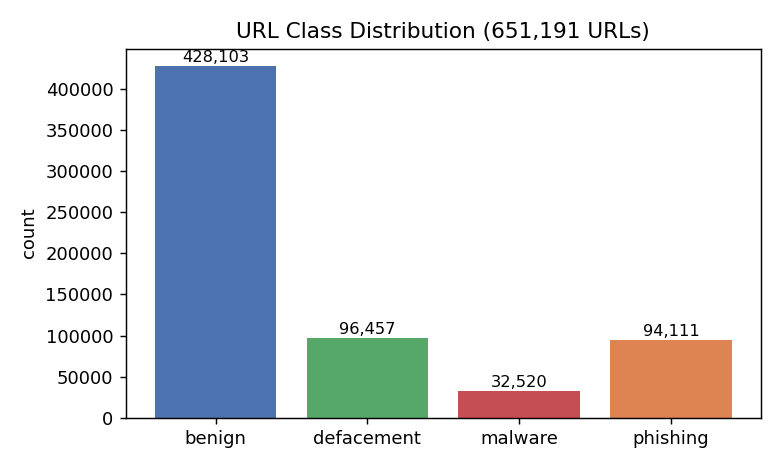
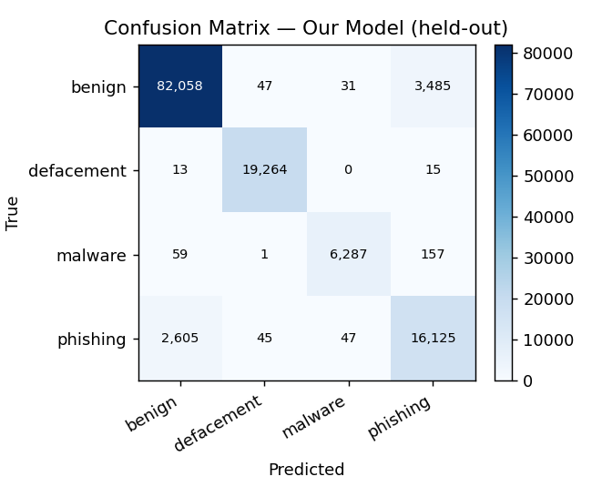
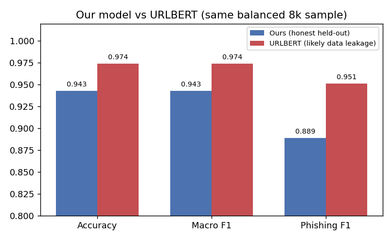
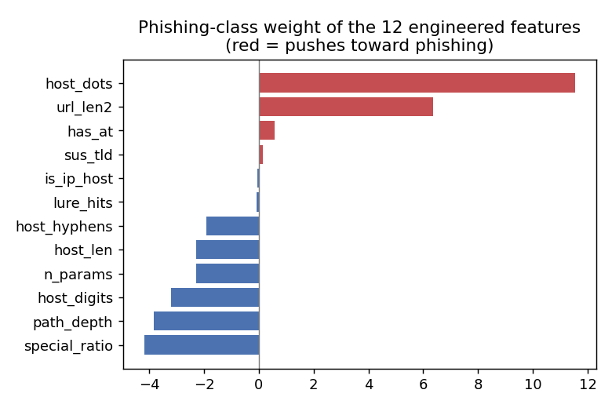

# Malicious URL Detection

Real-time, multi-class URL threat classifier — **benign / phishing / malware / defacement** — built on
hand-engineered features and classic ML. No DNS lookup, no page fetch: **pure string analysis**, so it can
score a URL in milliseconds at the moment a message arrives.

> **Part of a messaging-threat pipeline.** Its companion project,
> **[sms-spam-detector](https://github.com/johnsonchiang26-dev/sms-spam-detector)** (BERT),
> decides whether an incoming SMS is spam/phishing. This project then classifies any URL extracted from that message:
>
> ```
> SMS  →  BERT spam filter  →  extract URL  →  URL threat classifier (this repo)
> ```
>
> This maps directly onto two real product surfaces: **mobile/SMS security** and **web reputation / URL filtering**.

---

## Motivation

In a fintech messaging operation handling **90M+ SMS records**, the most common abuse vector is a phishing
message carrying a malicious link — OTP-phishing pages, credential-stuffing landing pages with randomized
subdomains, fake-login defacements. A model that judges a URL **from the string alone** can run inline, before
any network call, which is exactly what a real-time filter needs.

The dataset is the public **ISCX-URL-2016–derived corpus** (651,191 URLs; sources: ISCX, PhishTank,
PhishStorm, malware-domain blacklists).

## Pipeline

```
Raw URL
  │
  ├─ ① smart_decode      %E5%84%BF → 兒   (UTF-8 / GBK / Big5 / Shift-JIS / EUC-KR + xn-- Punycode)
  ├─ ② parse_structure   scheme · subdomain · domain · suffix(TLD) · path · query · file_ext   (robust to malformed URLs)
  ├─ ③ is_anomalous      drop random hash / UUID / base64 / high-entropy noise (vowel-ratio guard)
  ├─ ④ segment_token     English → wordsegment, Chinese → jieba
  ├─ ⑤ translate_many    non-English fields → English (Helsinki-NLP/opus-mt-mul-en, cached)
  ├─ ⑥ tokenize_url      role-tagged tokens: tld / domain / subdomain / file_ext / word / cjk / label_en / anomaly
  ├─ ⑦ extra_features    12 engineered phishing-clue features
  └─ Classifier          TF-IDF(word 1-2gram + char 3-5gram) + 21 numeric → LinearSVC   (+ URLBERT comparison)
```

All logic lives in [`url_features.py`](url_features.py); [`tagging.ipynb`](tagging.ipynb) walks the whole
thing end-to-end (32 cells, every cell executed with output).

## Results

**Held-out test set — 130,239 URLs, real (imbalanced) class distribution:**

| Class | Precision | Recall | F1 |
|------------|:---------:|:------:|:----:|
| benign | 0.968 | 0.958 | 0.963 |
| defacement | 0.995 | 0.999 | 0.997 |
| malware | 0.988 | 0.967 | 0.977 |
| **phishing** | 0.815 | 0.857 | **0.835** |
| **Accuracy** | | | **0.950** |
| **Macro-F1** | | | **0.943** |

**Effect of the engineered phishing features** (full test set):

| Model | Phishing-F1 |
|---|:---:|
| word-only baseline | 0.52 |
| + char n-grams, full data (§⑨b) | 0.816 |
| **+ 12 engineered phishing features (§⑨c)** | **0.835** |

**Head-to-head vs a pretrained transformer** (same balanced 8,000-URL sample for both):

| Model | Accuracy | Macro-F1 | Phishing-F1 |
|---|:---:|:---:|:---:|
| **Ours** (honest held-out) | 0.943 | 0.943 | 0.889 |
| URLBERT (`urlbert-tiny-v4`) — *likely trained on this dataset* | 0.974 | 0.974 | 0.951 |

<p align="center">
  
  <br>
  
  
</p>

## Key findings

- **A simple, interpretable model goes a long way.** TF-IDF (word + character n-grams) + numeric features +
  LinearSVC reaches **0.95 accuracy / 0.94 macro-F1** on a 130K held-out set — on CPU, training in minutes.
- **Feature engineering matters where it's hardest.** Phishing is the toughest class (it looks like benign
  traffic); the 12 hand-built clue features lifted phishing-F1 from 0.816 → 0.835, and the main residual error
  is benign↔phishing confusion — exactly as expected.
- **"Higher accuracy" can be an evaluation artifact.** URLBERT scores ~0.974, but it was almost certainly
  trained on this same public dataset — including our test rows — so its lead is inflated by data leakage. Our
  numbers are honest hold-out. *Knowing which number to trust is the real result.*
- **Decoding is itself a signal.** ~4.2% of URLs are percent-encoded; recovering them needs multiple encodings
  (UTF-8 26,703 · GBK 240 · Shift-JIS 19 · Big5 2). Decoded CJK content concentrates overwhelmingly in
  **malware** (4,126 of 5,774 CJK URLs; 12.7% of malware vs ~0% elsewhere).
- **URLs are not natural language.** There is no sentence grammar, so character/subword/structural features
  beat word-level language models; full-sentence segmenters are the wrong tool for the whole URL.

## Engineered features (`extra_features()`)

12 phishing-oriented numeric features, computed from the string alone:

| Feature | Intuition |
|---|---|
| `host_len`, `host_dots` | long hosts / deep subdomain chains (`a.b.c.d.evil.co`) |
| `host_digits`, `host_hyphens` | digit-stuffed and `paypal-secure-login`-style spoof hosts |
| `has_at` | `@`-obfuscation trick |
| `path_depth`, `n_params` | long deceptive paths / parameter stuffing |
| `sus_tld` | free/abused TLDs (`.tk .xyz .ml .gq …`) |
| `lure_hits` | brand/action lure keywords (login, secure, paypal, bank, verify…) in the **decoded** URL |
| `is_ip_host` | raw IP as host |
| `url_len2`, `special_ratio` | overall length and special-character density |

These sit alongside the 9 base numeric features (Shannon entropy, anomaly count, `has_cjk`, digit/special
counts, token count, encoded flag, URL length) and the TF-IDF text features.

## Repository

```
malicious-url-detector/
├── url_features.py        # core module: decode → parse → filter → segment → translate → tag → extra_features
├── tagging.ipynb          # end-to-end walkthrough (32 cells, executed)
├── data/                  # CSVs are git-ignored — see data/README.md to obtain them
├── docs/
│   ├── model_card.md
│   ├── resume_bullets.md
│   └── figures/           # the 4 plots above
├── models/                # trained classifier (git-ignored)
├── experiments/           # earlier prototypes / profiling scripts
├── requirements.txt
├── .gitignore
└── LICENSE
```

## Quickstart

```bash
pip install -r requirements.txt

# (a) tokenize / tag a single URL
python -c "import url_features as uf, json; print(json.dumps(uf.tokenize_url('http://paypal-secure-login.tk/account/verify', translate=True), ensure_ascii=False, default=str, indent=2))"

# (b) build the full feature table
python -c "import pandas as pd, url_features as uf; df=pd.read_csv('data/malicious_phish.csv'); uf.featurize_dataframe(df, extra=True).to_csv('data/url_features.csv', index=False)"

# (c) reproduce the model + figures + metrics: run tagging.ipynb top to bottom
```

The dataset (`data/malicious_phish.csv`) is the public *Malicious URLs dataset* (Kaggle / ISCX-URL-2016).
See [`data/README.md`](data/README.md).

## Professional context

Built by a Data Analyst / Data Engineer on a fintech BI data team, where the day job includes the ETL and
anomaly-alerting pipeline behind **90M+ SMS delivery records** (Python · Airflow · MySQL · Docker) and an
SMS anomaly early-warning system (ABCD severity tiering, P75/P90/P95 thresholds). This project externalizes
that operational threat experience into a reusable, real-time URL classifier.

## License

MIT — see [LICENSE](LICENSE).
